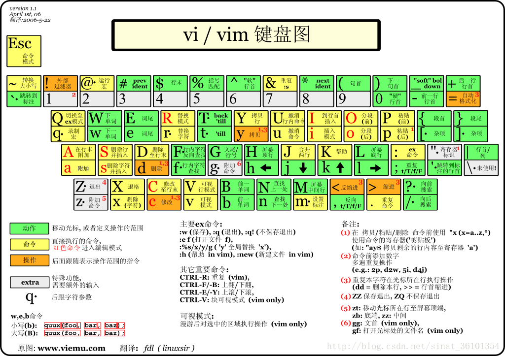

<!-- vim-markdown-toc GFM -->

* [安装 VIM8.x](#安装-vim8x)
* [插件安装](#插件安装)
* [常用操作](#常用操作)
	* [Fn功能键](#fn功能键)
	* [快捷键](#快捷键)
	* [文件查找](#文件查找)
		* [模糊搜索](#模糊搜索)
		* [已编辑文件搜索](#已编辑文件搜索)
	* [字符串替换](#字符串替换)
	* [标记-Mark](#标记-mark)
		* [添加标记](#添加标记)
		* [跳转标记](#跳转标记)
		* [查看标记](#查看标记)
		* [删除标记](#删除标记)
	* [多编辑框切换](#多编辑框切换)
	* [窗口调整](#窗口调整)
		* [上下](#上下)
		* [左右](#左右)
	* [文件对比](#文件对比)
	* [符号对齐](#符号对齐)
		* [等号对齐](#等号对齐)
		* [空格对齐](#空格对齐)
	* [其他](#其他)
		* [`末行模式`重定义空格](#末行模式重定义空格)
		* [多个标签切换](#多个标签切换)
		* [十六进制显示](#十六进制显示)
		* [ctags](#ctags)
* [修改配置](#修改配置)
	* [代码注释颜色](#代码注释颜色)
* [插件使用](#插件使用)
	* [目录](#目录)
		* [生成目录](#生成目录)
		* [更新目录](#更新目录)
* [Window下的gvim操作](#window下的gvim操作)
* [参考：](#参考)

<!-- vim-markdown-toc -->

# 安装 VIM8.x

```
sudo apt-get install vim
```
> Version: ubuntu18.04




# 插件安装

在已有插件的基础上使用`vundle`进行新的插件管理

进入vi执行：
``` shell
:PluginInstall
```


# 常用操作


## Fn功能键

| Fn  | 功能                                 |
|:---:|:-------------------------------------|
| F2  | doxygen格式的文件注释                |
| F3  | doxygen格式的函数注释                |
| F4  | 将当前目录下的目录树                 |
| F5  | TUML生成                             |
| F6  | 取消`//`注释，与F7相对               |
| F7  | 添加`//`注释                         |
| F8  | 当前的函数和全局变量列表（右侧列出） |
| F9  | 取消`/* ... */`注释，与F12相对       |
| F10 | 未使用，可留作新功能添加             |
| F11 | 未重定义，为系统全屏                 |
| F12 | 添加`/* ... */`注释                  |


## 快捷键

|     快捷键      | 功能                                                                                         |
|:---------------:|:---------------------------------------------------------------------------------------------|
|      `ds`       | 去除多余空格                                                                                 |
|      `dh`       | 去除多余空行                                                                                 |
|      `dm`       | 去除行尾^M                                                                                   |
|      `LB`       | 行首                                                                                         |
|      `LE`       | 行末                                                                                         |
|      `gf`       | 头文件跳转                                                                                   |
|      `gD`       | 跳转到局部变量的定义处                                                                       |
|   `Ctrl + ]`    | 跳转至函数或变量定义处                                                                       |
|   `Ctrl + o`    | 返回上一次跳转                                                                               |
|   `Ctrl + t`    | 返回上一次跳转                                                                               |
| `K (Shift + k)` | 函数man查找                                                                                  |
|      `qq`       | 直接退出                                                                                     |
|      `11`       | 去除行号                                                                                     |
|      `22`       | 显示行号                                                                                     |
|      `df`       | 添加应用层打印(debug printf) `printf("===> func: %s, line: %d\n", __func__, __LINE__);`      |
|      `dff`      | 添加应用层打印`printf("===> func: %s, line: %d, file: %s\n", __func__, __LINE__, __FILE__);` |
|      `dk`       | 添加内核打印(debug printk)`printk("===> func: %s, line: %d\n", __func__, __LINE__);`         |
|     `xdate`     | 自动输入当前时间(在`插入模式`下输入`xdate`)                                                  |
|      `;+f`      | 打开最近编辑的文件                                                                           |
|      `lf`       | 等价于F8                                                                                     |
|      `ld`       | 等价于F4                                                                                     |
|      `fw`       | 在当前目录下查找光标所在字符串                                                               |
|      `xml`      | 格式化xml文件                                                                                |
|     `json`      | 格式化json文件                                                                               |
|      `216`      | 转为十六进制显示                                                                             |
|       `%`       | 跳转到相配对的括号(括号匹配)                                                                 |
|       `"`       | 跳转到光标上次停靠的地方, 是连续两个`'`(键盘1旁边的间隔符)                                   |
|       `{`       | 跳到上一段的开头（不同函数开头）                                                             |
|       `}`       | 跳到下一段的的开头                                                                           |
|       `(`       | 移到这个句子的开头                                                                           |
|       `)`       | 移到下一个句子的开头                                                                         |
|      `[[`       | 跳转至上一个函数(要求代码块中'{'必须单独占一行)                                              |
|      `]]`       | 跳转至下一个函数(要求代码块中'{'必须单独占一行)                                              |
|    `q + :`      | 显示命令行模式中输入的命令的历史记录列表                                                     |
|    `q + /`      | 显示搜索记录                                                                                 |


## 文件查找

额外的功能组合键：`；`

```
let mapleader = ";"
let g:mapleader = ";"
```
### 模糊搜索

```
Ctrl + p
```
### 已编辑文件搜索

```
; +f
```

## 字符串替换

```
:[range]s/from/to/[flags]
```
- `range`: 搜索范围，如果没有指定范围，则作用于但前行, `%`表示在所有行中搜索替换
- `flags`:
	- `c`: confirm，每次替换前询问
	- `e`: error，不显示错误
	- `g`: globle，不询问，整行替换
	- `i`: ignore，忽略大小写


## 标记-Mark

标记的跳转可以跨文件

### 添加标记

```
m[0~9|a~z|A~Z]
```
|  标注   | 设置者  | 使用                                                                                                                              |
|:-------:|:-------:|:----------------------------------------------------------------------------------------------------------------------------------|
| `a`-`z` |  用户   | 仅对当前的一个文件生效，也就意味着只可以在当前文件中跳转                                                                          |
| `A`-`Z` |  用户   | 全局标注，可以作用于不同文件。大写标注也称为「文件标注」。跳转时有可能会切换到另一个缓冲区                                        |
| `0`-`9` | viminfo | 0 代表 viminfo 最后一次被写入的位置。实际使用中，就代表 Vim 进程最后一次结束的位置。1 代表 Vim 进程倒数第二次结束的位置，以此类推 |

### 跳转标记

```
`{mark}
```

### 查看标记

```
:marks
```

系统内置的特殊标记

| 标记  |          作用          |
|:-----:|:----------------------:|
|  `.`  |     最近编辑的位置     |
| `0-9` |     最近使用的文件     |
|  `^`  |     最近插入的位置     |
|   `   |   上一次跳转前的位置   |
|  `"`  | 上一次退出文件时的位置 |
|  `[`  |   上一次修改的开始处   |
|  `]`  |   上一次修改的结尾处   |


### 删除标记

```
::delmarks a b c
```
> 删除单个或多个标记

```
:delmarks!
```
> 删除所有标记mark

## 多编辑框切换

双击`w`

## 窗口调整

### 上下

大：`+`, 小：`-`

### 左右

大：`>`, 小: `<`

## 文件对比

```
vimdiff a1 a2
```
`do`: 将当前窗口光标位置处的内容复制到另一窗口
`dp`: 将另一窗口光标位置处的内容复制到当前窗口
`]c`: 跳转到下一个diff点
`[c`: 跳转到前一个diff点

## 符号对齐

先用v选择多行, `ga`进入easyalign模式, 默认`向左对齐`

### 等号对齐

1. 选中需要对齐的文本（Ctrl-V）
2. `ga + =`

### 空格对齐

1. 选中需要对齐的文本（Ctrl-V）
2. `ga + <space>`

## 其他

### `末行模式`重定义空格

为了搜索方便，此时`空格`相当于`/`


### 多个标签切换

`aa`  下一个标签

`zz`  上一个标签


### 十六进制显示

```
:%!xxd
```
### ctags

按键跳转Ctrl-],Ctrl-t,Ctrl-o
在创建tags文件的目录下，用vim打开的文件中，光标移到一个被调用的函数名上，按Ctrl-]就会自动跳转到该函数的定义处，Ctrl-t返回。

命令跳转
```
:tags  functionname
```
在用vim打开的文件中，用命令:tags  functionname。:ta functionname

打开时搜索并跳转
```
vim -t functionname
```
多个匹配tags时跳转
```
:tnext，:tprev，:tn,:tp
```
# 修改配置

## 代码注释颜色

``` C
hi Comment         ctermfg=49
```

# 插件使用

## 目录

### 生成目录
```
:GenTocGFM
```

### 更新目录
```
:UpdateToc
```

# Window下的gvim操作

|                 操作                  | 说明                                    |
|:-------------------------------------:|-----------------------------------------|
|  Shift+v(选中) <br/>`Shift` `+` `y`   | 选中区域复制到剪切板（vim->其他程序）   |
|            `Shift` `*` `y`            | 当前行复制到剪切板                      |
| `Shift` `+` `p` <br/> `Shift` `*` `p` | 选中区域粘贴剪切板内容（其他程序->vim） |

# 参考：

1. [像 IDE 一样使用 vim](https://github.com/yangyangwithgnu/use_vim_as_ide)
